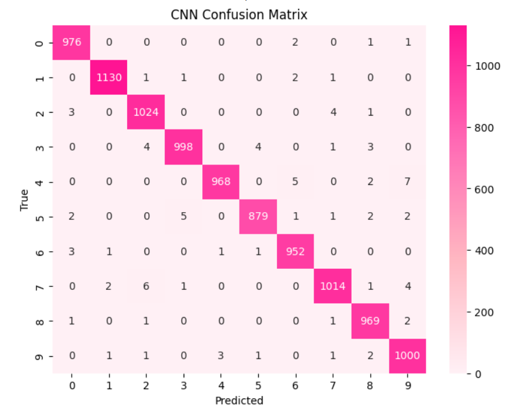
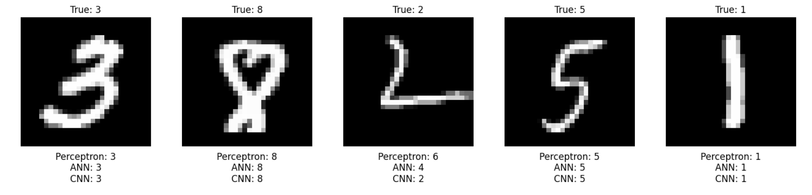

# ✍️ Handwritten Digits Identification using CNN

A deep learning project for identifying handwritten digits **(0–9)** using a **Convolutional Neural Network (CNN)** trained on the MNIST dataset.

---

## 📌 Project Overview

Handwritten digit recognition is a classic **Computer Vision** problem and a popular application of **Convolutional Neural Networks (CNNs)**.

In this project, a CNN is built using **TensorFlow/Keras** to classify grayscale images of handwritten digits into one of **10 classes (0–9)**.

The project covers the complete deep learning workflow:

- 📥 Loading the MNIST dataset
- 🧹 Data preprocessing
- 🔄 Reshaping images for CNN input
- 🧠 Building a Convolutional Neural Network
- 🚀 Training the model
- 📊 Evaluating model performance
- 📈 Visualizing training and validation performance
- 🔮 Generating predictions on test data
- 🧩 Evaluating predictions using a confusion matrix

---

## 🧠 CNN Architecture

The CNN consists of convolutional and pooling layers followed by fully connected layers for final digit classification.

### Architecture

```text
🖼️ Input Image (28 × 28)
        ↓
🧠 Convolutional Layer
        ↓
🔽 Pooling Layer
        ↓
🧠 Convolutional Layer
        ↓
🔽 Pooling Layer
        ↓
📐 Flatten
        ↓
🔗 Dense Layer
        ↓
🎯 Output Layer (10 Classes)
```

The final output layer uses **Softmax activation** to predict the probability of each digit from **0 to 9**.

---

## 📊 Dataset

The project uses the **MNIST Handwritten Digits Dataset**.

### Dataset Details

- 🖼️ Image size: **28 × 28 pixels**
- 🎨 Image type: **Grayscale**
- 🔢 Number of classes: **10**
- 🏷️ Classes: **0, 1, 2, 3, 4, 5, 6, 7, 8, 9**

### 📥 Download the Dataset

The raw CSV dataset files are not included in this repository because of their relatively large file size.
You can easily download the exact CSV-format dataset used in this project from Kaggle:

👉 **[MNIST in CSV – Kaggle](https://www.kaggle.com/datasets/oddrationale/mnist-in-csv)**

The dataset contains:

- `mnist_train.csv` — 60,000 training examples
- `mnist_test.csv` — 10,000 test examples

Each row contains **785 values**: one label followed by 784 pixel values corresponding to the 28 × 28 image. :contentReference[oaicite:1]{index=1}

After downloading, place both CSV files in the location expected by the notebook and run the notebook.

---

## 🛠️ Technologies & Libraries

- 🐍 **Python**
- 🔢 **NumPy**
- 🐼 **Pandas**
- 📊 **Matplotlib**
- 🎨 **Seaborn**
- 🤖 **Scikit-learn**
- 🧠 **TensorFlow / Keras**
- ☁️ **Google Colab / Jupyter Notebook**
- 📦 **Kaggle**

---

## 📁 Project Structure

```text
handwritten-digits-identification/
│
├── 📂 images/
│
├── 📓 handwritten_digits_identification.ipynb
│
├── 📄 requirements.txt
│
└── 📖 README.md
```

---

## 🔄 Project Workflow

```text
📊 MNIST Dataset
       ↓
📥 Data Loading
       ↓
🧹 Data Preprocessing
       ↓
🔄 Image Reshaping
       ↓
🧠 CNN Model Building
       ↓
🚀 Model Training
       ↓
📊 Model Evaluation
       ↓
🔮 Predictions
       ↓
🧩 Confusion Matrix
```

---

## 📈 Model Evaluation

The CNN model is evaluated using:

- 🎯 Training Accuracy
- 🎯 Validation Accuracy
- 📉 Training Loss
- 📉 Validation Loss
- 🧩 Confusion Matrix

The confusion matrix provides a detailed view of how accurately the model distinguishes between the different handwritten digits.

---

## 🧩 Confusion Matrix

The confusion matrix visualizes the model's predictions for each digit.

The **diagonal values** represent correctly classified images, while the off-diagonal values represent incorrect predictions.

---

## 📸 Results & Visualizations

### 🧩 Confusion Matrix



### 📈 Sample Predictions



---

## 🚀 How to Run

### 1️⃣ Clone the Repository

```bash
git clone https://github.com/PalakMallik/handwritten-digits-identification.git
```

### 2️⃣ Navigate to the Project Directory

```bash
cd handwritten-digits-identification
```

### 3️⃣ Install Dependencies

```bash
pip install -r requirements.txt
```

### 4️⃣ Run the Notebook

Open:

```text
handwritten_digits_identification.ipynb
```

The notebook can be run using:

- ☁️ Google Colab
- 📓 Jupyter Notebook

---

## 📦 Requirements

The required Python libraries are listed in `requirements.txt`:

```text
numpy
pandas
matplotlib
seaborn
scikit-learn
tensorflow
```

---

## 🎯 Key Learning Outcomes

Through this project, I explored:

- 🧠 Fundamentals of Convolutional Neural Networks
- 🖼️ Image preprocessing for deep learning
- 🔍 CNN layers and architecture
- ⚙️ Model training and validation
- 🎯 Multi-class image classification
- 📊 Model evaluation techniques
- 🧩 Confusion matrix analysis
- 📈 Visualization of model performance
- 🤖 Practical implementation using TensorFlow/Keras

---

## 🌟 Future Improvements

Some possible improvements for this project include:

- ✍️ Building a web interface for handwritten digit prediction
- 🚀 Deploying the trained model using Streamlit
- 🎨 Allowing users to draw a digit and get a prediction
- 📊 Comparing CNN performance with other machine learning models
- 🔧 Experimenting with different CNN architectures

---

## 👩‍💻 Author

### **Palak Mallik**

🔗 GitHub: https://github.com/PalakMallik

---

⭐ **If you found this project interesting, consider giving the repository a star!** ⭐

💡 *Built as a deep learning project to explore Convolutional Neural Networks and image classification.*
